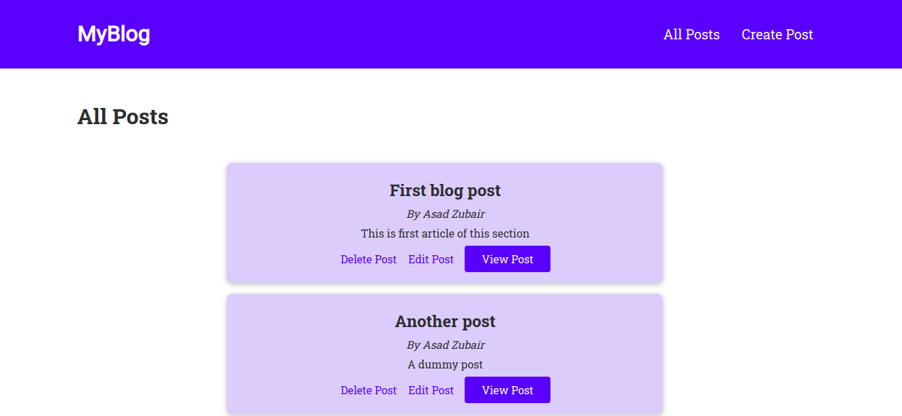

# blog_template
This project is for my portfolio. It is a blog template not styled a lot but focuses on the database concepts and CRUD operations.

## Table of contents

- [Overview](#Overview)  
  - [Landing page screenshot](#Landing-page)  
  - [Create post page screenshot](#Create-post-page)  
  - [Comments portion screenshot](#Comments-portion)  
  
- [Built with](#Built-with)  
- [Setup MongoDB](#Prerequisite-to-start-development-server)  
  - [Start Mongosh](#Start-Mongosh)  
  - [Start node JS server](#Start-node-JS-server)  
  - [Browser Link](#Browser)  
  
- [Continued development](#Continued-development)

## Overview
 
### Landing-page


### Create-post-page


### Comments-portion


## Built-with

- HTML 5
- CSS
- JavaScript
- Ajax
- Node JS 
- Express JS 
- MongoDB

## Prerequisite-to-start-development-server

You have to install mongodb and start mongodb service.
The process is different for Windows, Mac, and linux.
And then add an author or number of authors in the database to get started.

### Start-Mongosh
Type ``mongosh`` in terminal or powershell.
And then
```
use blog
```
```
db.authors.insertOne({ name: '<dummy_author_name>', email: '<dummy_email>' }) 
```

### Start node JS server

Clone this repository and navigate to this project folder through terminal or powershell.
Then run
```
npm install
```
It will install all dependencies and packages.
And then to start the server:
```
npm start
```

### Browser

In browser URL paste the link: ``` http://localhost:3000/ ```

Now you can play around.

### Continued-development

Yes you can Modify this code and can style it however you want.
